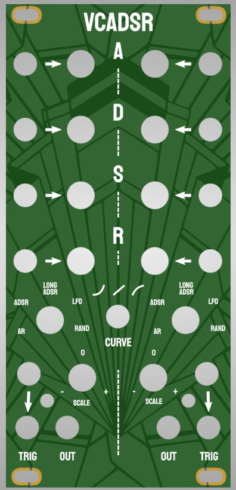

# Eurorack DUAL Voltage controlled AR / ADSR / LFO / Random / S&H Utility Module

This project is a dual utility module on the basis of an Arduino nano that does a bunch of neat things.
It is fully through hole and has relatively standard parts (safe for maybe the DAC module but you can get that on aliexpress)

## Status: Confirmed working!

## Hardware and PCB

 

The module has one Panel PCB and one circuit PCB, relatively straight forward, just order with standard settings on jlcpcb or any other pcb site.
The build is relatively straight forward, but there is one spot at the top where the IC and pot kind of overlap a bit. be sure
to not have stuff standing out too much from the IC so that it contacts the metal housing of the pots and shorts. should be doable

## Code

The code is under the firmware folder and can be uploaded to the nano using the arduino IDE.
For the MUX chip it uses the "Analog digital Multiplexers" library found here: [source repo](https://github.com/stechio/arduino-ad-mux-lib?tab=readme-ov-file) ,
[arduino libraries page](https://docs.arduino.cc/libraries/analog-digital-multiplexers/).
You can get it from the library browser inside arduino IDE.

## Operation
In general, to make it easier on myself I have wired it such that the CV replaces knob values so the knobs are useless if something is plugged in.
In my experience this is not that much of a problem as you usually either want to dial in a specific shape or have an lfo etc plugged in.
The cool (at least I think it's cool) thing is that you can change CV during a phase to affect the progession of the current phase.

The modules has the following modes:
 - Attack-release: When triggered, does an attack, then a release
 - Attack-Decay-sustain-release: When triggered, does ADSR as a normal envelope would. 
 - Long Attack-Decay-sustain-release: as normal ADSR but longer by a factor 10
 - LFO: Goes from Attack to Decay to release immediately, then back to attack. Trigger retriggers the attack stage
 - RAND: Random values. Attack Pot changes minimum value, Decay pot changes value range. Each trigger gives a new value. **By plugging in CV to attack and setting Decay pot to 0 you can use it as a sample/hold which I think is very neat!** Sustain pot quantizes to one of six scales, but this is a bit experimental and might now work perfectly since all output is scaled by the scale pot and by arduino internal 5V conversion anyways.
 
 
 Curve switch switches between linear, exponential and logarithmic. This is the one thing shared by both channels otherwise they operate independently.
 
